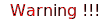
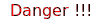

# github-markdown

- github markdown links and  useful thoughts

## Markdown sources

- [Github Mastering Markdown](https://guides.github.com/features/mastering-markdown)
- [Github Basic writing and formatting syntax](https://help.github.com/articles/basic-writing-and-formatting-syntax/)
- [Emoji cheat sheet for Github](https://www.webpagefx.com/tools/emoji-cheat-sheet/)
- [Markdown rules for Github](https://github.com/DavidAnson/markdownlint/blob/v0.6.4/doc/Rules.md#md007)

## Microsoft Visual Studio Code plugins

- [vscode plugin  Auto-Open Markdown Preview](https://marketplace.visualstudio.com/items?itemName=hnw.vscode-auto-open-markdown-preview)
- [vscode plugin Code Spell Checker](https://marketplace.visualstudio.com/items?itemName=streetsidesoftware.code-spell-checker)
- [vscode plugin Markdown lint](https://marketplace.visualstudio.com/items?itemName=DavidAnson.vscode-markdownlint)
- [EditorConfig for VS Code](https://marketplace.visualstudio.com/items?itemName=EditorConfig.EditorConfig)
- set indent_size = 2 for github markdown nested list

## GitHub Function

- [GitHub Teams](https://help.github.com/articles/about-teams/)

## Signal Words as SVG

- [GitHub Sanitize](https://github.com/rgrove/sanitize/#readme) is a whitelist-based HTML and CSS sanitizer. Given a list of acceptable elements, attributes, and CSS properties, Sanitize will remove all unacceptable HTML and/or CSS from a string.

- So I'm used SVG graphic for this
  - 
  - 
  - 